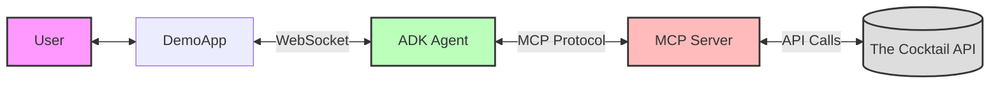

# An ADK Agent integrated with MCP Client
(Original Source: https://github.com/GoogleCloudPlatform/generative-ai/blob/main/gemini/mcp/adk_mcp_app/README.md)

This web application was developed using Google ADK (Agent Development Kit) and MCP (Model Context Protocol). Specifically, the Agent relies on the Google ADK. A local MCP server instance, established using custom server code designed for cocktail data management, facilitates data retrieval. The web application acts as an MCP client to fetch cocktail information via this local server.

## System Architecture



The diagram above illustrates the relationship between the user, web application, ADK agent, MCP server, and the external Cocktail API. The user interacts with the web application, which communicates with the ADK agent via WebSocket. The agent uses the MCP protocol to interact with the MCP server, which in turn makes API calls to The Cocktail API to retrieve information.

Screenshot:

<!--  -->

  
This example demonstrates how you can chat with the app to retrieve cocktail details from [The Cocktail DB](https://www.thecocktaildb.com/) website using a local MCP server.

## Project Structure

```none
your_project_folder/
├── main.py
├── .env
├── .env.sample
├── Makefile             # Automation script
├── requirements.txt
├── mcp_server/
│   └── cocktail.py
├── README.md
└── static/
    └── index.html
```

## Features

- **Traditional Chinese responses**: System is configured to always respond in Traditional Chinese
- **Streaming responses**: Real-time display of generated responses for better user experience
- **Cocktail information queries**: Support for various cocktail-related queries
- **Intuitive user interface**: Optimized frontend design with example questions
- **Automation scripts**: Simplified installation and running process through Makefile

## Getting Started

### Using Makefile (Recommended)

We provide a Makefile to simplify the setup and running process:

```sh
# Check environment setup
make init

# Install dependencies
make install

# Run the application and automatically open browser
make run-local

# Or execute all steps at once
make all
or
make
```

### Manual Setup

#### Create & Activate Virtual Environment (Recommended)

```sh
python -m venv .venv
source .venv/bin/activate  # Linux/Mac
# or
.venv\Scripts\activate  # Windows
```

#### Install Dependencies

```sh
pip install -r requirements.txt
```

#### Configure Environment Variables

Copy `.env.sample` to `.env` and fill in your API key and project information:

```sh
# Choose Model Backend: 0 -> Gemini Developer API, 1 -> Vertex AI
GOOGLE_GENAI_USE_VERTEXAI=1

# Gemini Developer API backend config
GOOGLE_API_KEY=YOUR_VALUE_HERE

# Vertex AI backend config
GOOGLE_CLOUD_PROJECT="<your project id>"
GOOGLE_CLOUD_LOCATION="us-central1"
```

#### Run the Application

```sh
uvicorn main:app --reload
```

#### Access the Application

Open [http://localhost:8000](http://localhost:8000) in your browser

## Usage

After starting the application, you can:

1. View example questions to understand what types of content you can ask about
2. Enter your question in the input field
3. Click the "Send" button to send your question
4. Watch the streaming response being generated

## Technical Details

- **Backend**: FastAPI and Google ADK
- **Frontend**: HTML, CSS, and JavaScript
- **Model**: Gemini 2.5 Pro
- **Communication**: WebSocket for streaming responses
